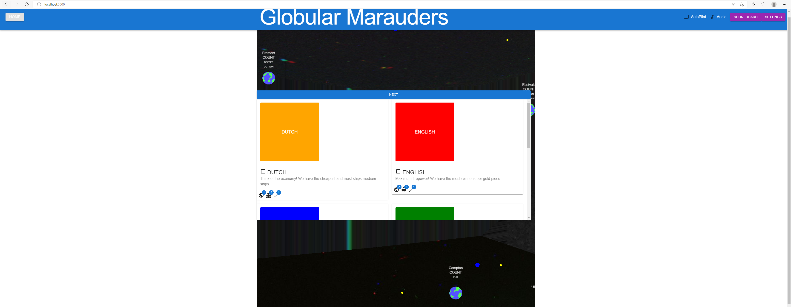
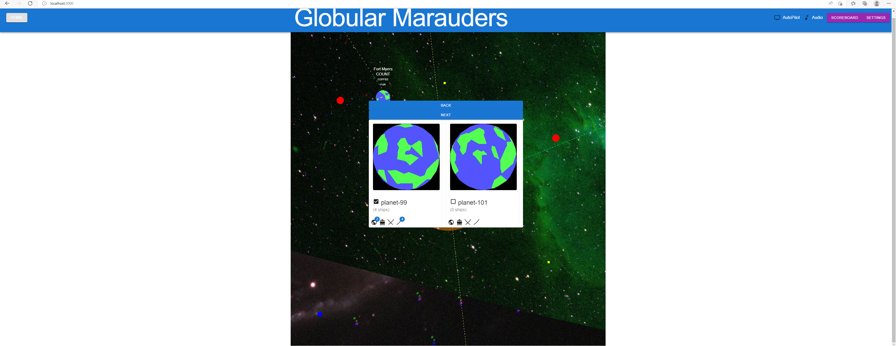
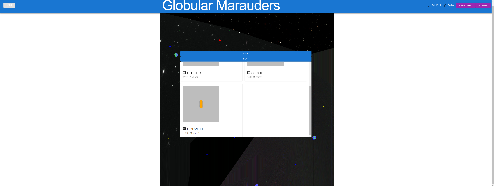

## Globular Marauders

Space Pirate + (Wizards TBD) 2d spaceship shooter. The game is asteroids on a sphere with pirate ships that only shoot
sideways. When you move forward, you will forever continue moving forward unless you press the break. When you rotate
left or right, you will continue rotating until you cancel the rotation. You also can only fire 2, 4, or 8 cannonballs
out each side. An asteroid game where you can only shoot sideways. Also note that if you travel in one direction for
long enough, you will loop around the entire sphere.

The micro goal is to dominate the 6 scoreboards:
- Damage (attack and destroy every enemy)
- Loot (steal their precious cargo for money and loot points)
- Money (completing missions will give you money)
- Land (being MVP by being the first settler or best invader will give you planets)
  - There's a feudal scoring system based on combinations of nearby planets:
    - Count - 1 planet
    - Baron - 2 nearby planets
    - Duke - 3 nearby planets
    - Arch Duke - 1 Full Duchy + 1 Duchy Capital
    - King - 1 Full Duchy + 2 Duchy Capital
    - Emperor - 1 Full Duchy + 2 Duchy Capital + 1 Kingdom Capital
- Capture (gather the most invasion points by beating back the defenders and sitting on their colonies, no spawns you)
- Bounty (kill players who are causing trouble against your faction)

The macro goal is to destroy all other factions for world domination by collecting all 180 planets.

# The main menu

# The game

